   Document

**WIRESHARK**

Wireshark is a free, open-source packet analyzer. It captures network traffic on the local network and stores that data for offline analysis.

Its primary usage is for network troubleshooting, analysis, software and communications protocol development, as well as education.

Wireshark is the most often-used packet sniffer in the world. Like any other packet sniffer, Wireshark does three things:

*   Packet Capture: Wireshark listens to a network connection in real time and then grabs entire streams of traffic – quite possibly tens of thousands of packets at a time.
*   Filtering: Wireshark is capable of slicing and dicing all of this random live data using filters. By applying a filter, you can obtain just the information you need to see.
*   Visualization: Wireshark, like any good packet sniffer, allows you to dive right into the very middle of a network packet. It also allows you to visualize entire conversations and network streams.

Some of the features of Wireshark include:

1.  Data can be captured 'from the wire' from a live network connection or read from a file of captured packets.
2.  Live data can be read from different types of networks, including Ethernet, IEEE 802.11, PPP, and LoopBack.
3.  Data display can be refined using a display filter.
4.  Plugins can be created for dissecting new protocols.
5.  VoIP calls in the captured traffic can be detected. If encoded in a compatible encoding, the media flow can even be played.
6.  Raw USB traffic can be captured.
7.  Various settings, timers and filters can be set to filter the output of the captured traffic.

  
**Capturing Live Packets using Wireshark**

Open Wireshark

*   It will bring Capture interface window. It will list all available interfaces.
*   Select eth0

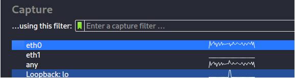  

Click on start button to begin your capture

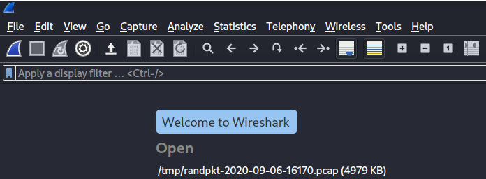

Open your browser and visit any website, e.g facebook.com

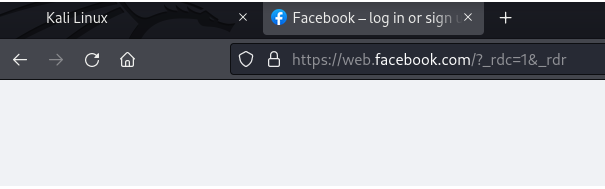

Stop the capturing by clicking on the red button

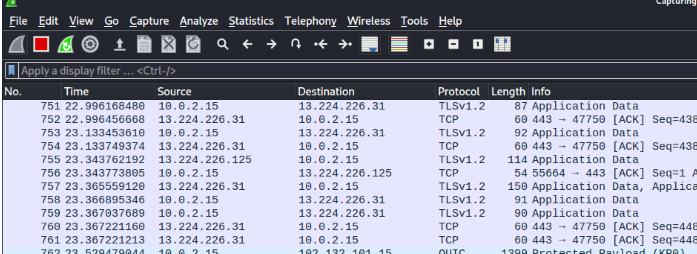

Go to display filter and search for Facebook.

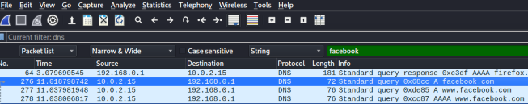  
  
**Anayzing Packet with wireshark**

You can download free pcap files online

[PCAP File Download](https://tcpreplay.appneta.com/wiki/captures.html)

SmallFlows.pcap file will be used for analysis purpose. Open wireshark, click on file then go to open file.

Then locate the file path and open it

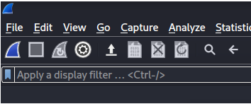  

Once it opens, the captured packets is represented in three different windows. The total number of the packet captured is displayed at the bottom (14261)

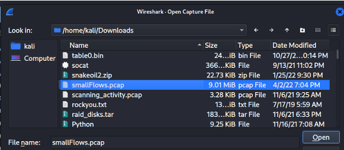  

The first window shows the packet number, time, source IP addr, Destination IP addr, protocol, length of data and information.

  
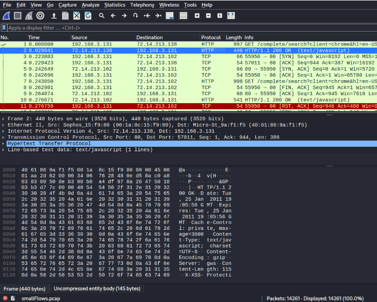  

The second windows display the selected packet frameworks and its protocol

Each frame can be expanded by clicking on > to show more details about the selected packet.

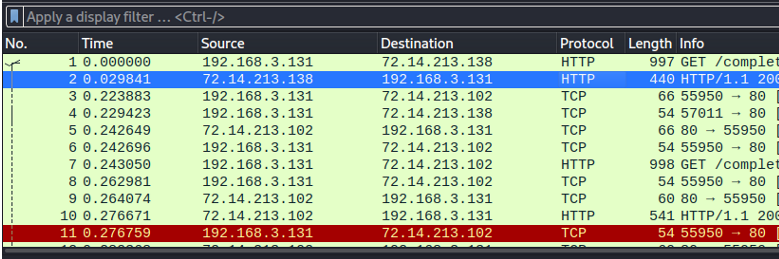  

Click on > Hypertext Transfer Protocol. More details about the HTTP of the selected packet will be displayed

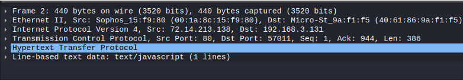  
  
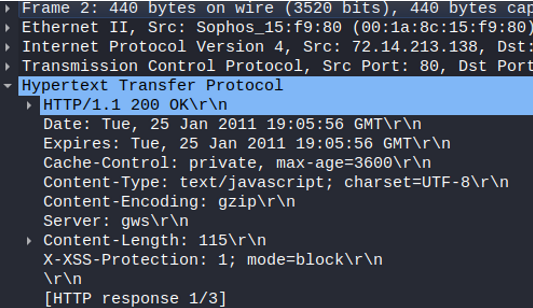  

The third window show the hex of the selected packet which is segmented into 4 columns.

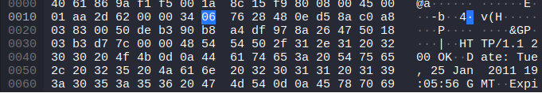  

Clicking on any of the hex, it will display the corresponding data on the fourth column.

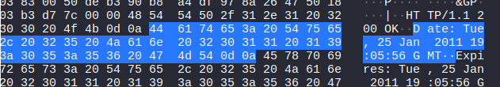  
  
**Filtering**  

Filtering can help you search for specific packets. Wireshark provides a simple display filter language which allows the creation of filter expressions.

Every field in the packet details pane can be used as a filter string; for example, the filter ‘DNS’ will show all the packets containing the DNS protocol.

Operators such as == and && can be used to compare and combine expressions.

For example, a display filter to show SNMP (port 161) and ICMP traffic would look like this:

1.  tcp.port eq 161 or ICMP
2.  ip.addr - Specifies an IPv4 address
3.  ipv6.addr - Specifies an IPv6 address
4.  src Source - where the packet came from
5.  dst Destination - where the packet is going
6.  &&/and - Means “and,” as in, “Choose the IP address of 192.168.2.1 and 192.168.2.2”
7.  \==/eq - Means “equals,” as in “Choose only IP address 192.168.2.1”
8.  !/ne - Means “not,” as in, do not show a particular IP address or source port
9.  ||/or -Means "or"

For example, a display filter to show IP addr 72.14.213.102 and HTTP traffic would look like this: ip.addr == 72.14.213.102 && http

From the result, there is just 2 packets matching the filter expression.

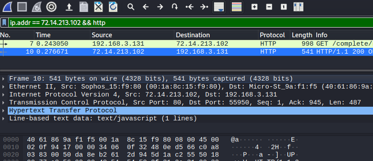  
  
**_Additional filters:_**

*   tcp.port==8080 - Filters packets to show a port of your own choosing – in this case, port 8080
*   !(ip.src == 162.248.16.53) - Shows all packets except those originating from 162.248.16.53
*   ip.addr == 192.168.4.1 && ip.addr == 192.168.4.2 - Shows both 192.168.4.1 and 192.168.4.2
*   http.request - Shows only http requests – useful when troubleshooting or visualizing web traffic

**_Using display filter to search for strings_**

Click on search

It will display a filter

Change the display filter to strings in order to search for a string Search for string "skype"

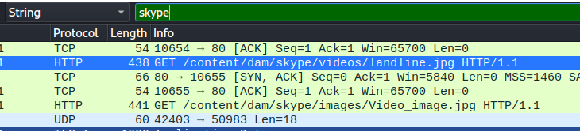  
  
**Streams**

it is often useful to view the network the way it is seen in the application layer.

The most common stream type is TCP, but Wireshark also recognizes application types such as HTTP, UDP, and TLS, which can assemble these streams into a single view.

A data stream can be viewed and extracted directly from the packet view in Wireshark by right clicking on the desired packet

\> Follow Stream. By doing this, an ASCII interpretation of the raw file is presented alongside the option to save the raw file to disk.

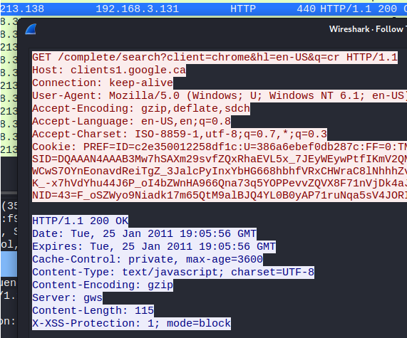  
  
**Exporting Objects**

Wireshark provides a variety of options for exporting the packet data. These ‘objects’ are files which can be reconstructed from HTTP and SMB streams.

To extract objects from the packet capture, go to File > Export Objects and select the object type from the list.

\>In the new window select the file to extract and click ‘Save’; alternatively, you can hit ‘Save All’ if you wish to extract all objects of that type.

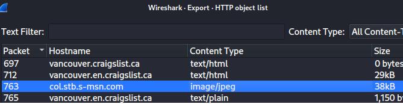  

Select the directory to save the image file. You can rename the image. Then hit save.

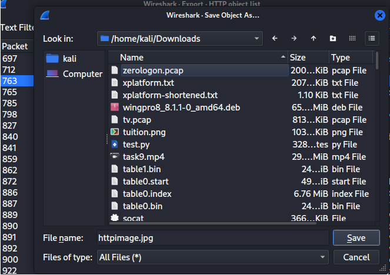

The image file is saved in the download directory

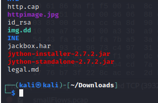

The view of the image file

Exporting objects is beneficial from a cyber defense analyst's perspective because it allows them to recover artefacts from the network capture for closer examination.

Inspection of these artefacts can lead to important discoveries about the assembled evidence needed for an investigation.

**Statistics Tab**

It gives the visualization of the packets in form of graph, tabular form etc. It’s also possible to capture the amount of traffic generated between one system and another.

_Conversation_

It shows the summary of conversations between endpoints. If you go to Statistics and then select Conversations

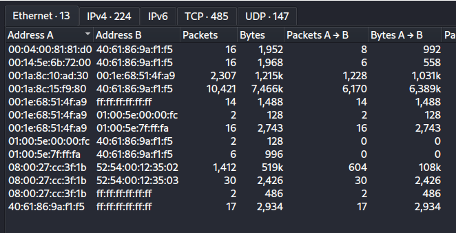  

Click on IPv4

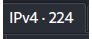  
  
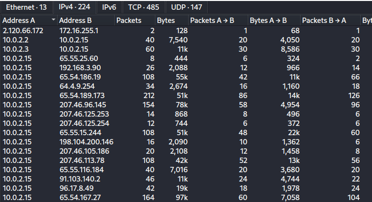

For detailed information of the conversation between the two endpoints, right click on the conversation And select Apply as Filter > Selected > A<->B

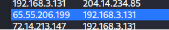  
  
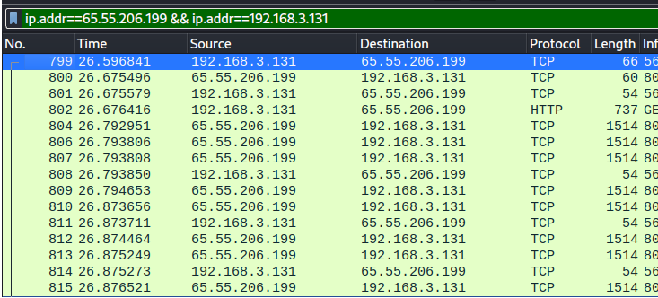

_As we can see, we can analyze the packets between endpoints on a local network to understand the communication between them. Wireshark is a powerful application._
